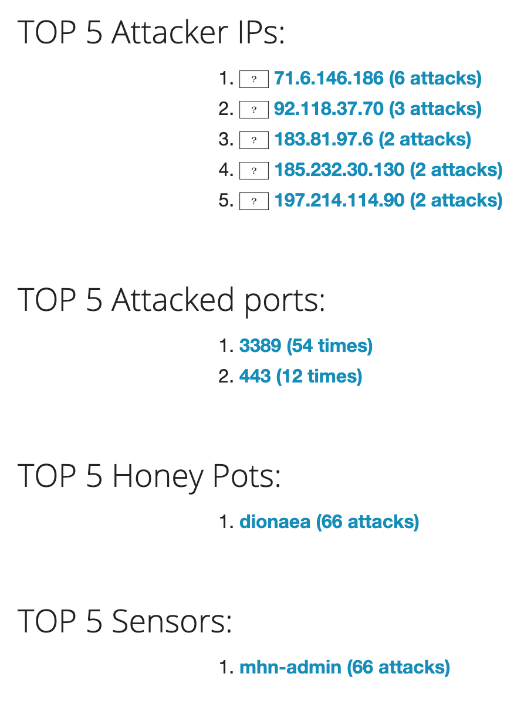
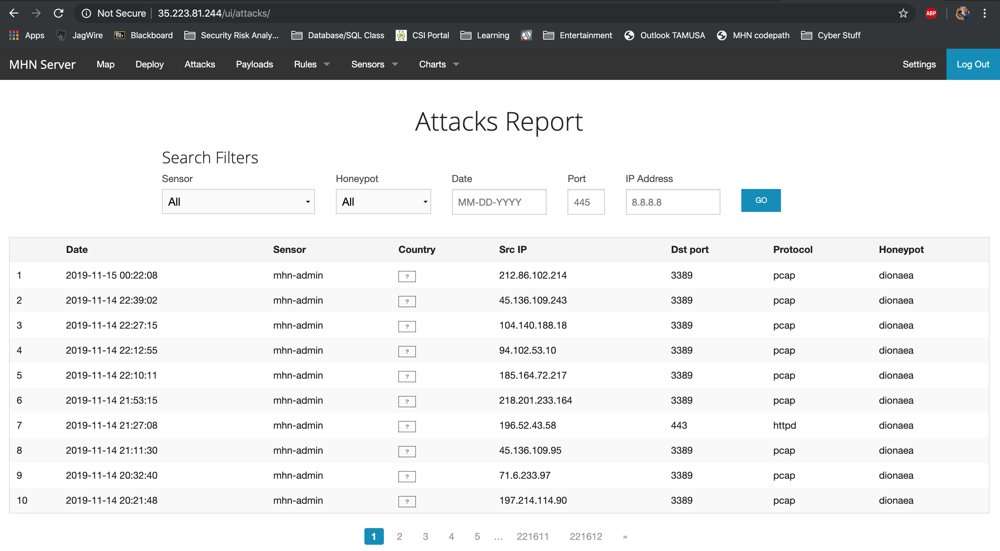
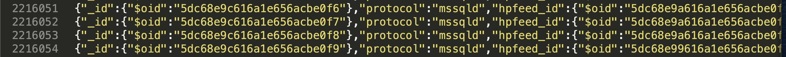

# HoneyPot - Week11
Hours Spent: 10

## Overview and Setup Process

In this assignment, we used Google Cloud platform to setup 2 cloud based virtual machines.  The first was the MHN Admin machine where we were able to control the honeypot and manage it from the this console.  The second was the Honeynet where we set up the environment that would be attacked and we used sensors to to collect attack data.  So much virtualization to this point in my education, in general, has been with Virtual Box or VMWare so, it was interesting to utilize a cloud platfrom to deploy machines to the cloud.  I had never worked with GCP before so it was nice getting some exposure to that.    

## Demonstration Documentation

 - Below you can see the VM I created in GCP
 
 
 - I Nmapped the machine below and recieved the shown response from Kali Linux.  I noticed that the firewall rules didn't seeem to take inside of the honey net.  Only one port (22) was shown to be open.  You can see that the machine is a GCP machine running an Ubuntu OS.  
 
 
 - Immediately after deployment, the attacks started coming in and the summary of the first couple of hours is depicted below.
 
 
 - I set up the VMs in week 10 and let them sit and get attacked for roughtly 7 days and collected over 2.2 million attacks in that time frame.  Pretty jarring to see how quickly attacks came in after deployment.
 
 
 -  I exported the JSON file to my machine after collecting honey and the session.json file ended up being enormous.  Below, I took a screenshot of the bottom of the file to show the 2.2 million attacks.
 

- Sample output of the JSON file:
```json
{"_id":{"$oid":"5dc1e818616a1e656a88400c"},"protocol":"mssqld","hpfeed_id":{"$oid":"5dc1e818616a1e656a88400b"},"timestamp":{"$date":"2019-11-05T21:22:32.352Z"},"source_ip":"95.46.78.190","source_port":49924,"destination_port":1433,"identifier":"4e05d2b8-0012-11ea-bded-42010a800002","honeypot":"dionaea"}
{"_id":{"$oid":"5dc1e81e616a1e656a884010"},"protocol":"mssqld","hpfeed_id":{"$oid":"5dc1e81e616a1e656a88400f"},"timestamp":{"$date":"2019-11-05T21:22:38.686Z"},"source_ip":"95.46.78.190","source_port":50704,"destination_port":1433,"identifier":"4e05d2b8-0012-11ea-bded-42010a800002","honeypot":"dionaea"}
{"_id":{"$oid":"5dc1e81e616a1e656a884011"},"protocol":"mssqld","hpfeed_id":{"$oid":"5dc1e81d616a1e656a88400e"},"timestamp":{"$date":"2019-11-05T21:22:37.948Z"},"source_ip":"95.46.78.190","source_port":50623,"destination_port":1433,"identifier":"4e05d2b8-0012-11ea-bded-42010a800002","honeypot":"dionaea"}
{"_id":{"$oid":"5dc1e81e616a1e656a884012"},"protocol":"mssqld","hpfeed_id":{"$oid":"5dc1e81d616a1e656a88400d"},"timestamp":{"$date":"2019-11-05T21:22:37.398Z"},"source_ip":"95.46.78.190","source_port":50565,"destination_port":1433,"identifier":"4e05d2b8-0012-11ea-bded-42010a800002","honeypot":"dionaea"}
{"_id":{"$oid":"5dc1e821616a1e656a884017"},"protocol":"mssqld","hpfeed_id":{"$oid":"5dc1e821616a1e656a884016"},"timestamp":{"$date":"2019-11-05T21:22:41.486Z"},"source_ip":"95.46.78.190","source_port":51063,"destination_port":1433,"identifier":"4e05d2b8-0012-11ea-bded-42010a800002","honeypot":"dionaea"}
{"_id":{"$oid":"5dc1e821616a1e656a884018"},"protocol":"mssqld","hpfeed_id":{"$oid":"5dc1e820616a1e656a884015"},"timestamp":{"$date":"2019-11-05T21:22:40.757Z"},"source_ip":"95.46.78.190","source_port":50956,"destination_port":1433,"identifier":"4e05d2b8-0012-11ea-bded-42010a800002","honeypot":"dionaea"}
{"_id":{"$oid":"5dc1e821616a1e656a884019"},"protocol":"mssqld","hpfeed_id":{"$oid":"5dc1e820616a1e656a884014"},"timestamp":{"$date":"2019-11-05T21:22:40.261Z"},"source_ip":"95.46.78.190","source_port":50895,"destination_port":1433,"identifier":"4e05d2b8-0012-11ea-bded-42010a800002","honeypot":"dionaea"}
{"_id":{"$oid":"5dc1e821616a1e656a88401a"},"protocol":"mssqld","hpfeed_id":{"$oid":"5dc1e81f616a1e656a884013"},"timestamp":{"$date":"2019-11-05T21:22:39.476Z"},"source_ip":"95.46.78.190","source_port":50815,"destination_port":1433,"identifier":"4e05d2b8-0012-11ea-bded-42010a800002","honeypot":"dionaea"}
{"_id":{"$oid":"5dc1e824616a1e656a88401f"},"protocol":"mssqld","hpfeed_id":{"$oid":"5dc1e824616a1e656a88401e"},"timestamp":{"$date":"2019-11-05T21:22:44.193Z"},"source_ip":"95.46.78.190","source_port":51393,"destination_port":1433,"identifier":"4e05d2b8-0012-11ea-bded-42010a800002","honeypot":"dionaea"}
{"_id":{"$oid":"5dc1e824616a1e656a884020"},"protocol":"mssqld","hpfeed_id":{"$oid":"5dc1e823616a1e656a88401d"},"timestamp":{"$date":"2019-11-05T21:22:43.435Z"},"source_ip":"95.46.78.190","source_port":51296,"destination_port":1433,"identifier":"4e05d2b8-0012-11ea-bded-42010a800002","honeypot":"dionaea"}
{"_id":{"$oid":"5dc1e824616a1e656a884021"},"protocol":"mssqld","hpfeed_id":{"$oid":"5dc1e822616a1e656a88401c"},"timestamp":{"$date":"2019-11-05T21:22:42.948Z"},"source_ip":"95.46.78.190","source_port":51214,"destination_port":1433,"identifier":"4e05d2b8-0012-11ea-bded-42010a800002","honeypot":"dionaea"}
{"_id":{"$oid":"5dc1e824616a1e656a884022"},"protocol":"mssqld","hpfeed_id":{"$oid":"5dc1e822616a1e656a88401b"},"timestamp":{"$date":"2019-11-05T21:22:42.215Z"},"source_ip":"95.46.78.190","source_port":51145,"destination_port":1433,"identifier":"4e05d2b8-0012-11ea-bded-42010a800002","honeypot":"dionaea"}
{"_id":{"$oid":"5dc1e827616a1e656a884028"},"protocol":"mssqld","hpfeed_id":{"$oid":"5dc1e827616a1e656a884027"},"timestamp":{"$date":"2019-11-05T21:22:47.744Z"},"source_ip":"95.46.78.190","source_port":51814,"destination_port":1433,"identifier":"4e05d2b8-0012-11ea-bded-42010a800002","honeypot":"dionaea"}
{"_id":{"$oid":"5dc1e827616a1e656a884029"},"protocol":"mssqld","hpfeed_id":{"$oid":"5dc1e826616a1e656a884026"},"timestamp":{"$date":"2019-11-05T21:22:46.968Z"},"source_ip":"95.46.78.190","source_port":51697,"destination_port":1433,"identifier":"4e05d2b8-0012-11ea-bded-42010a800002","honeypot":"dionaea"}
{"_id":{"$oid":"5dc1e827616a1e656a88402a"},"protocol":"mssqld","hpfeed_id":{"$oid":"5dc1e826616a1e656a884025"},"timestamp":{"$date":"2019-11-05T21:22:46.219Z"},"source_ip":"95.46.78.190","source_port":51632,"destination_port":1433,"identifier":"4e05d2b8-0012-11ea-bded-42010a800002","honeypot":"dionaea"}
{"_id":{"$oid":"5dc1e827616a1e656a88402b"},"protocol":"mssqld","hpfeed_id":{"$oid":"5dc1e825616a1e656a884024"},"timestamp":{"$date":"2019-11-05T21:22:45.704Z"},"source_ip":"95.46.78.190","source_port":51573,"destination_port":1433,"identifier":"4e05d2b8-0012-11ea-bded-42010a800002","honeypot":"dionaea"}
{"_id":{"$oid":"5dc1e827616a1e656a88402c"},"protocol":"mssqld","hpfeed_id":{"$oid":"5dc1e824616a1e656a884023"},"timestamp":{"$date":"2019-11-05T21:22:44.938Z"},"source_ip":"95.46.78.190","source_port":51453,"destination_port":1433,"identifier":"4e05d2b8-0012-11ea-bded-42010a800002","honeypot":"dionaea"}
{"_id":{"$oid":"5dc1e82a616a1e656a884031"},"protocol":"mssqld","hpfeed_id":{"$oid":"5dc1e82a616a1e656a884030"},"timestamp":{"$date":"2019-11-05T21:22:50.612Z"},"source_ip":"95.46.78.190","source_port":52155,"destination_port":1433,"identifier":"4e05d2b8-0012-11ea-bded-42010a800002","honeypot":"dionaea"}
{"_id":{"$oid":"5dc1e82a616a1e656a884032"},"protocol":"mssqld","hpfeed_id":{"$oid":"5dc1e829616a1e656a88402f"},"timestamp":{"$date":"2019-11-05T21:22:49.835Z"},"source_ip":"95.46.78.190","source_port":52064,"destination_port":1433,"identifier":"4e05d2b8-0012-11ea-bded-42010a800002","honeypot":"dionaea"}
{"_id":{"$oid":"5dc1e82a616a1e656a884033"},"protocol":"mssqld","hpfeed_id":{"$oid":"5dc1e829616a1e656a88402e"},"timestamp":{"$date":"2019-11-05T21:22:49.090Z"},"source_ip":"95.46.78.190","source_port":51945,"destination_port":1433,"identifier":"4e05d2b8-0012-11ea-bded-42010a800002","honeypot":"dionaea"}
{"_id":{"$oid":"5dc1e82a616a1e656a884034"},"protocol":"mssqld","hpfeed_id":{"$oid":"5dc1e828616a1e656a88402d"},"timestamp":{"$date":"2019-11-05T21:22:48.564Z"},"source_ip":"95.46.78.190","source_port":51905,"destination_port":1433,"identifier":"4e05d2b8-0012-11ea-bded-42010a800002","honeypot":"dionaea"}
{"_id":{"$oid":"5dc1e82d616a1e656a884039"},"protocol":"mssqld","hpfeed_id":{"$oid":"5dc1e82d616a1e656a884038"},"timestamp":{"$date":"2019-11-05T21:22:53.384Z"},"source_ip":"95.46.78.190","source_port":52459,"destination_port":1433,"identifier":"4e05d2b8-0012-11ea-bded-42010a800002","honeypot":"dionaea"}
{"_id":{"$oid":"5dc1e82d616a1e656a88403a"},"protocol":"mssqld","hpfeed_id":{"$oid":"5dc1e82c616a1e656a884037"},"timestamp":{"$date":"2019-11-05T21:22:52.628Z"},"source_ip":"95.46.78.190","source_port":52398,"destination_port":1433,"identifier":"4e05d2b8-0012-11ea-bded-42010a800002","honeypot":"dionaea"}
{"_id":{"$oid":"5dc1e82d616a1e656a88403b"},"protocol":"mssqld","hpfeed_id":{"$oid":"5dc1e82b616a1e656a884036"},"timestamp":{"$date":"2019-11-05T21:22:51.873Z"},"source_ip":"95.46.78.190","source_port":52298,"destination_port":1433,"identifier":"4e05d2b8-0012-11ea-bded-42010a800002","honeypot":"dionaea"}
{"_id":{"$oid":"5dc1e82d616a1e656a88403c"},"protocol":"mssqld","hpfeed_id":{"$oid":"5dc1e82b616a1e656a884035"},"timestamp":{"$date":"2019-11-05T21:22:51.354Z"},"source_ip":"95.46.78.190","source_port":52223,"destination_port":1433,"identifier":"4e05d2b8-0012-11ea-bded-42010a800002","honeypot":"dionaea"}
{"_id":{"$oid":"5dc1e830616a1e656a884041"},"protocol":"mssqld","hpfeed_id":{"$oid":"5dc1e830616a1e656a884040"},"timestamp":{"$date":"2019-11-05T21:22:56.113Z"},"source_ip":"95.46.78.190","source_port":52793,"destination_port":1433,"identifier":"4e05d2b8-0012-11ea-bded-42010a800002","honeypot":"dionaea"}
{"_id":{"$oid":"5dc1e830616a1e656a884042"},"protocol":"mssqld","hpfeed_id":{"$oid":"5dc1e82f616a1e656a88403f"},"timestamp":{"$date":"2019-11-05T21:22:55.370Z"},"source_ip":"95.46.78.190","source_port":52696,"destination_port":1433,"identifier":"4e05d2b8-0012-11ea-bded-42010a800002","honeypot":"dionaea"}
{"_id":{"$oid":"5dc1e830616a1e656a884043"},"protocol":"mssqld","hpfeed_id":{"$oid":"5dc1e82e616a1e656a88403e"},"timestamp":{"$date":"2019-11-05T21:22:54.628Z"},"source_ip":"95.46.78.190","source_port":52635,"destination_port":1433,"identifier":"4e05d2b8-0012-11ea-bded-42010a800002","honeypot":"dionaea"}
{"_id":{"$oid":"5dc1e830616a1e656a884044"},"protocol":"mssqld","hpfeed_id":{"$oid":"5dc1e82e616a1e656a88403d"},"timestamp":{"$date":"2019-11-05T21:22:54.151Z"},"source_ip":"95.46.78.190","source_port":52569,"destination_port":1433,"identifier":"4e05d2b8-0012-11ea-bded-42010a800002","honeypot":"dionaea"}

```
