# Objective: 
Assess a web application and write a report identifying findings, associated risk, and recommended solutions. Report anticipated residual risk if proposed solutions were implemented. 
This lab involves the assessment of a web application and a second web service. You are tasked with obtaining a shell from the target web server hosting by exploiting vulnerabilities in the web application and web service.

# Vulnerability 1: Anonymous FTP

### Summary:
The most critical and obvious vulnerability discovered was that “Anonymous” login was enabled on the FTP server.  Anonymous login enables anyone to connect to, and log into the server by simply using the ‘anonymous’ username and leaving the password field blank.  The anonymous user in this situation is also given permissions to “get” and “put” files into the server.  I was able to exploit this weakness and upload a reverse shell php script to the webserver through the “uploads” directory – the directory has ‘write’ privileges.  By utilizing an IDOR technique, I was able to browse to the php file directly by manipulating the URL.
 
### Walkthrough:

 - First did an Nmap scan to gather information on the target web server.  The scan report indicates port 21, 22, and 80 are open and that “anonymous ftp login” is allowed.  We also see the list of files currently on the server along with their set permissions.
 
 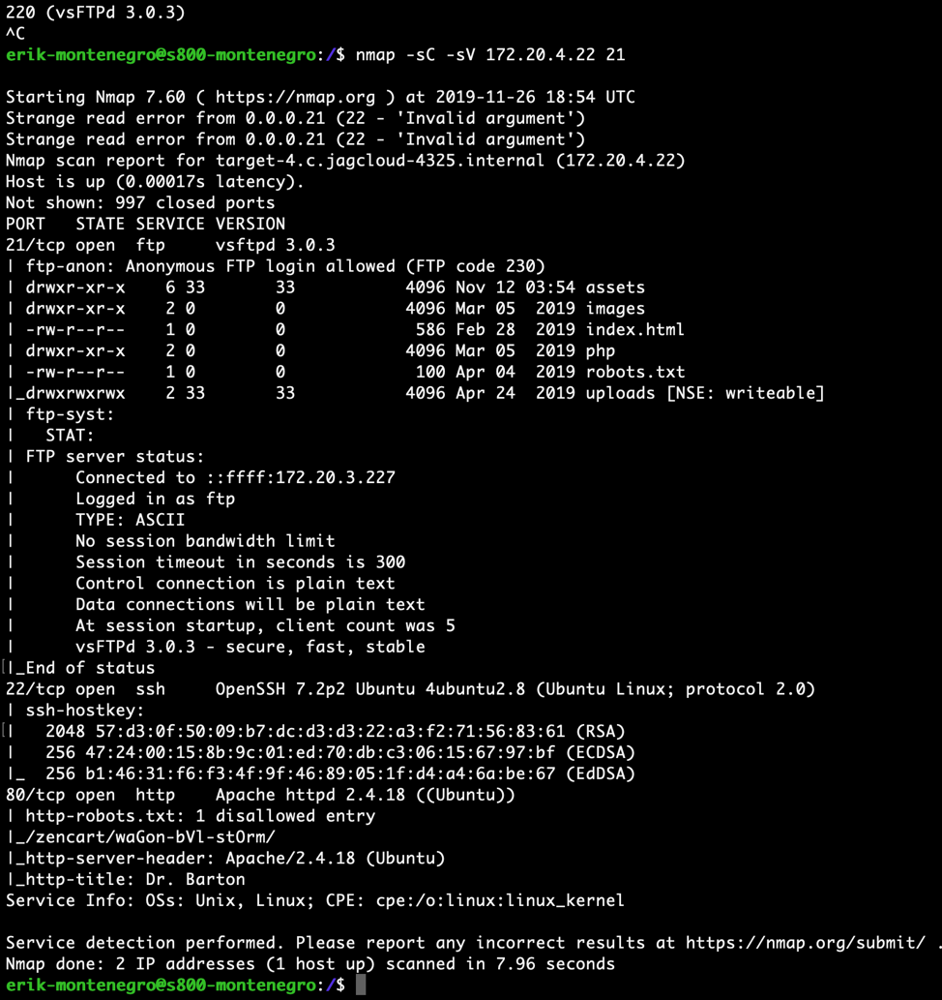
 
 - Here, we have a successful login into the FTP server
  
  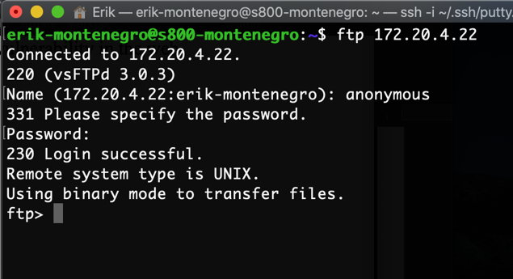
  
 - After browsing to the site, I was able to manipulate the URL and browse to a few interesting pages by manipulating the URL path. 
  *Assets page and uploads page were able to be pulled up directly.*
  
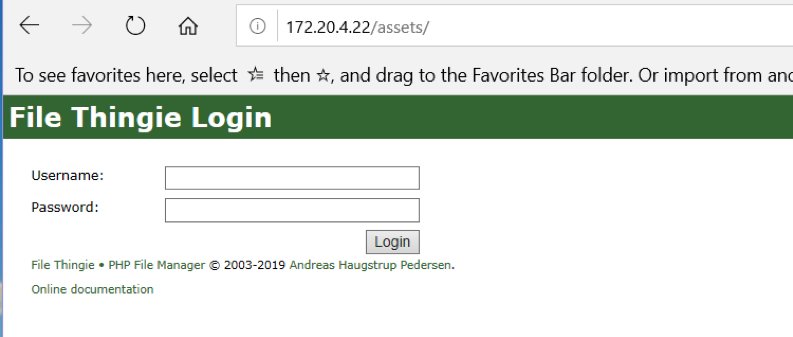

 - Interesting that the “File Thingie” page shows the version that it is running.  Tried to upload the php file here and see if it would take, but the site responded with an ‘invalid file type'.
 
 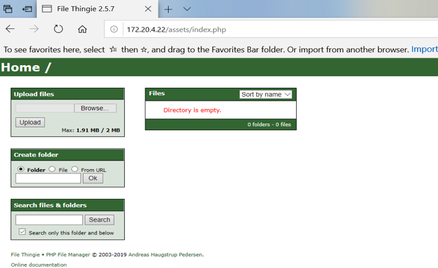
 
 - Found a php reverse shell script, edited it to direct a connection to my JagCloud instance on port 4444.
 
 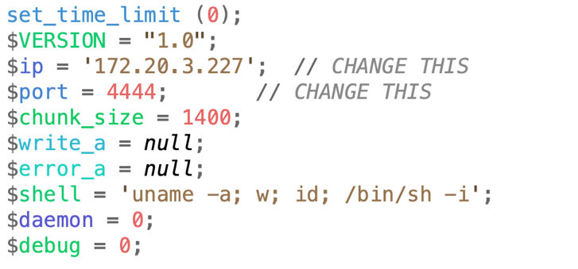
 
 - I then used the anonymous login to upload the shell file directly to the webserver.  The “uploads” directory fortunately had write privileges so I moved the file there.
 
 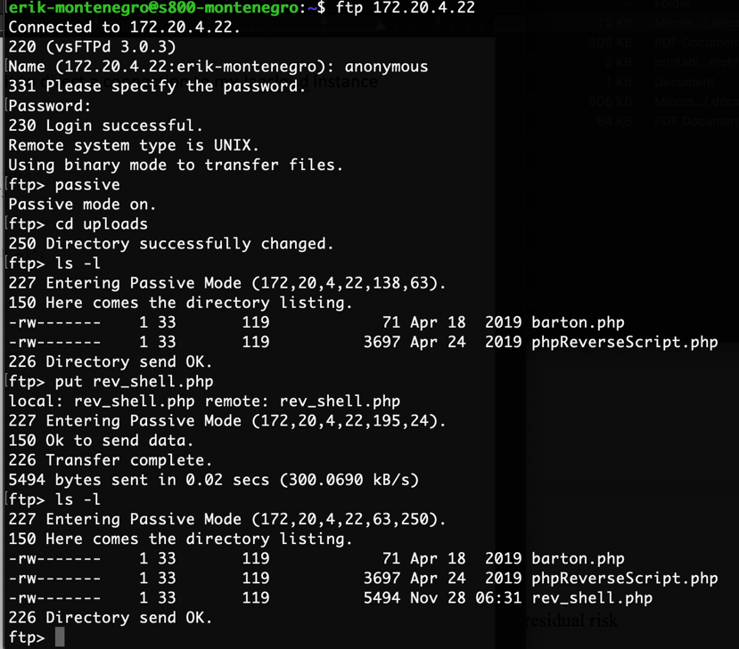
 
 - Browsing back to the webpage, we can see that the file was successfully uploaded.
 
 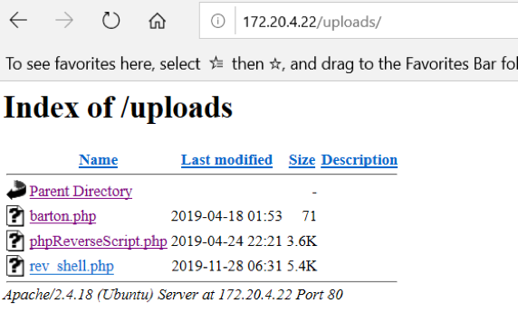
 
 - Successfully executed the reverse shell script by clicking the link to the file.
 
 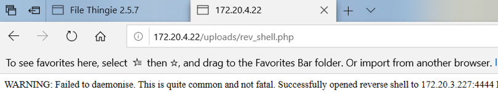
  
 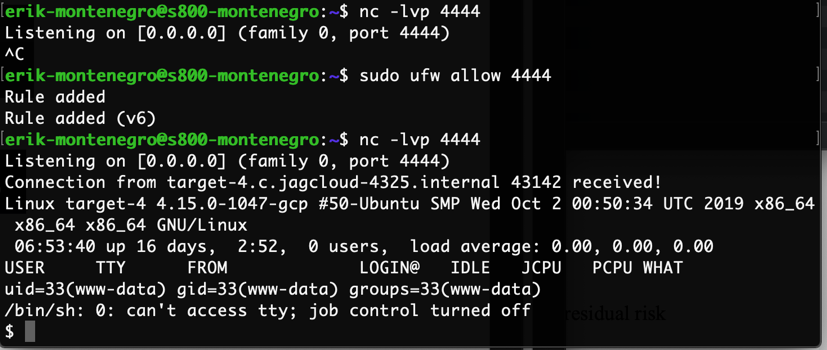
  
 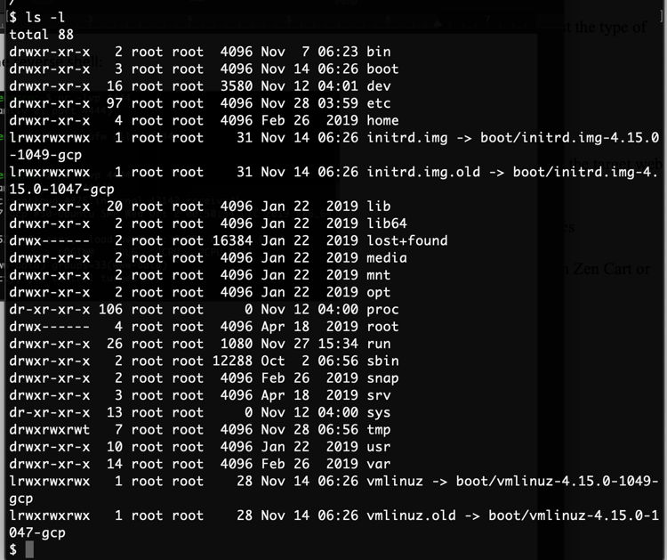
 
 # Vulnerability 2: “File Thingie” 2.5.7 Contains Known Vulnerability
 
 ### Summary:
After doing a little research on this version of the “File Thingie” service being ran on the server, Exploit DB provides us with information regarding an arbitrary file upload vulnerability which allows an attacker to upload malicious .zip archives.  Documentation and proof of concept information were available in the Exploit Database website via the following link.
https://<i><i/>www.exploit-db.com/exploits/47349
Php files are not an acceptable file type to be uploaded to the server when uploaded by themselves.  Concealing them in a zip file was an effective workaround.  I noticed that some other php files that were successfully uploaded and bypassed input validation by adding a second extension to the file name.  Even though the web app would “filter” out the php file I uploaded, I could see that the unzipped folder showed that it contained 4 files even though it only listed 3.  Thus, proving that the file was present even though it was hidden.
  
 ### Walkthrough:
 
 - First, created a file that contained 4 different file types to test in order to ensure successful upload to the server.  Compressed them into a zip file named “shell_montenegro” and proceeded to upload.
 
 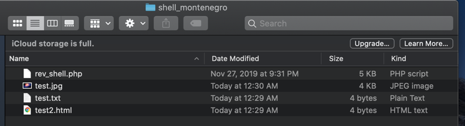
 
 - Once the zip file was uploaded, the diamond shaped button gave us a menu of various actions we could perform on the file, including the ability to unzip “shell_montenegro.”
 
 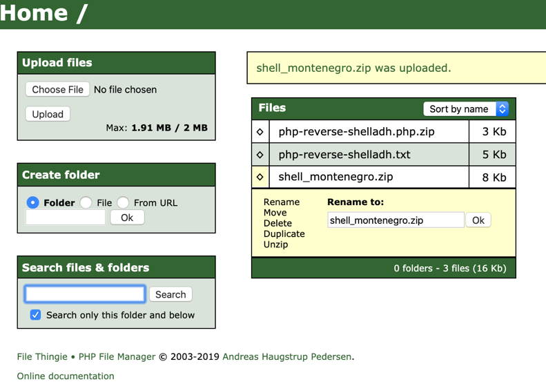
 
 - After unzipping the file, the application is showing that “shell_montenegro” contains 4 files, but once we open the file we are only shown three of the test files.  Evidently, the php file was successfully uploaded but is somehow being hidden by the web application.
 
 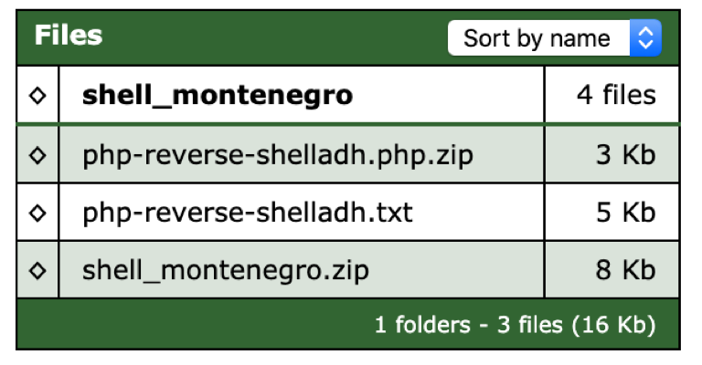
 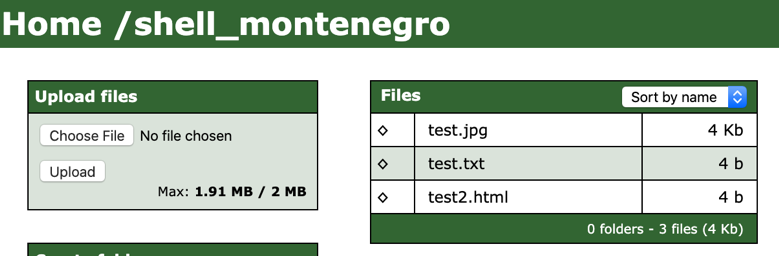
 
 - Checked each test file one by one to ensure that the site would allow me to open each file.  I noticed that with each file I opened, the URL in the browser would show the path to each file. ( i.e. – ip/assets/FolderName/FileName )
 
 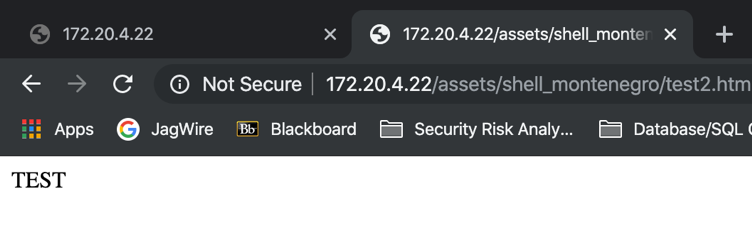
 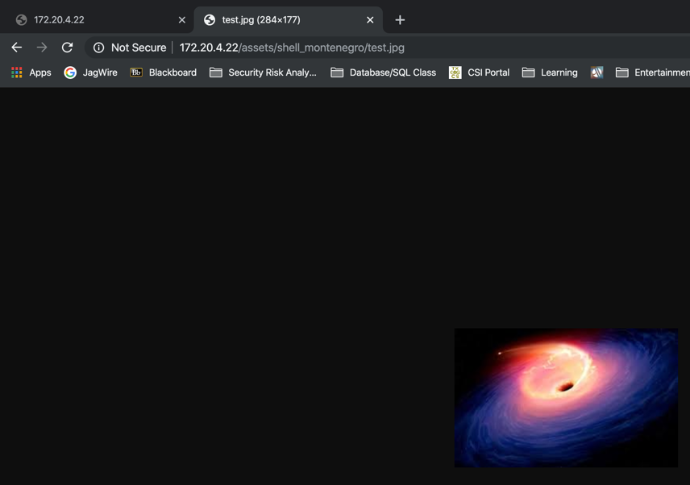
 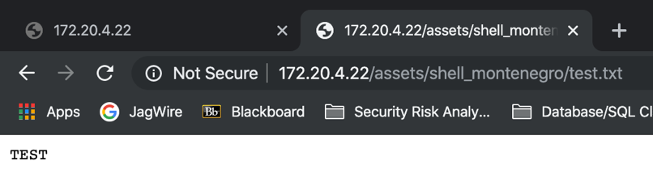
 
 - After opening the three files that were inside the “shell_montenegro” zip, I was able to notice a pattern in the URL.  The path to my files was how the website was referencing each file.  The logic was that if I knew the web app uploaded my four files and that they were all located in the same place, I should be to IDOR to execute the php shell.
 
 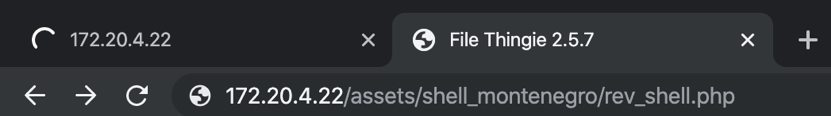
 
 - Successfully captured the shell.

 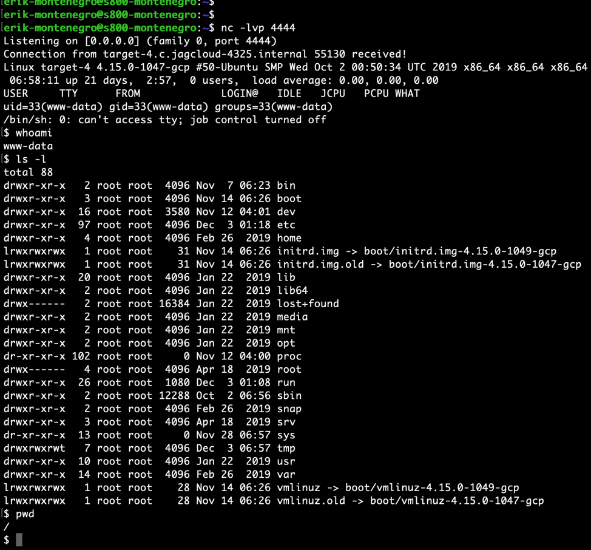

